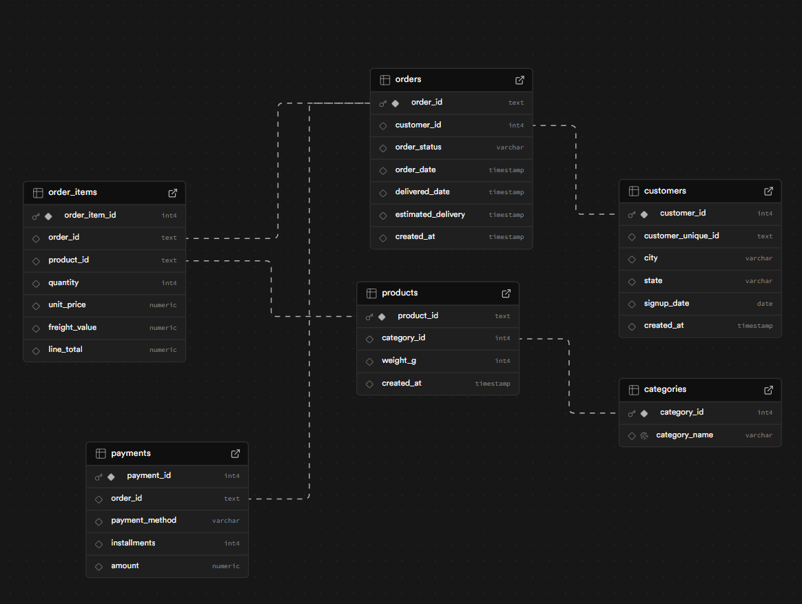

# E-Commerce Marketplace Analytics (SQL Case Study)

## Overview
This project analyzes transactional data from an e-commerce marketplace to understand revenue growth, customer purchasing behavior, retention patterns, and product performance.

The analysis was conducted entirely using SQL on a PostgreSQL database designed using a star schema approach.

## Business Problem

An e-commerce marketplace wants to understand whether its growth is sustainable and what drives revenue performance.

Key questions addressed:

- Is revenue growing consistently over time?
- Is growth driven by new or returning customers?
- How concentrated is revenue across customers and products?
- How frequently do customers repurchase?
- Which customer segments generate the most value?

## Dataset

The dataset contains order-level transactional data including:

- Customers
- Orders
- Order items
- Products and categories
- Payments

Data was ingested into PostgreSQL and transformed into an analytics-ready schema.

## Data Model

A star schema was implemented to support analytical queries.

- Dimension tables: customers, products, categories
- Fact tables: orders, order_items, payments

## Analytical Approach

The analysis was performed in structured phases:

1. **Business Health Analysis**
   - Monthly revenue trends
   - Growth validation

2. **Customer Behavior Analysis**
   - New vs returning customers
   - Repeat purchase rate
   - Purchase frequency distribution

3. **Product Performance**
   - Revenue by category
   - Product concentration (Pareto analysis)
   - Basket size analysis

4. **Retention Analysis**
   - Cohort analysis
   - Purchase cycle measurement

5. **Customer Segmentation**
   - RFM segmentation
   - Revenue contribution by segment

## Key Insights

- Revenue growth is primarily acquisition-driven rather than retention-driven.
- ~97% of customers make only one purchase.
- Average basket size is 1.14 items, indicating mission-based shopping behavior.
- Customers who return typically repurchase after ~78 days.
- 28% of products generate 80% of total revenue.
- The largest share of revenue comes from customers classified as "At Risk".

## Business Recommendations

- Introduce post-purchase engagement within 60–90 days.
- Target high-value at-risk customers with reactivation campaigns.
- Promote complementary products to increase basket size.
- Focus merchandising efforts on high-performing categories.

## Tools & Skills Demonstrated

- SQL (PostgreSQL)
- Data Modeling (Star Schema)
- Window Functions
- Cohort Analysis
- RFM Segmentation
- Analytical Problem Solving
- Business Insight Development

## Challenges Encountered & Resolutions

During this project, several technical and analytical challenges were encountered while building an end-to-end SQL analytics workflow. Resolving these issues helped strengthen both data engineering and analytical problem-solving skills.

### 1. Understanding Database Tooling vs Database Engine
**Challenge:**  
Initially, there was confusion between PostgreSQL, SQL, SQL engines, and database clients (pgAdmin, DBeaver).

**Resolution:**  
Clarified architectural roles:
- PostgreSQL as the database engine
- SQL as the query language
- pgAdmin as a management interface  
This helped establish a clear mental model for interacting with databases.

---

### 2. Designing an Analytics-Friendly Data Model
**Challenge:**  
Raw datasets were not structured for analysis and contained redundant or operational-level information.

**Resolution:**  
Implemented a **star schema** by separating:
- Raw ingestion schema
- Analytics schema  
Created fact and dimension tables to simplify analytical queries.

---

### 3. Data Import Errors and Schema Mismatches
**Challenge:**  
CSV imports failed due to column mismatches and inconsistent headers.

**Resolution:**  
Validated CSV structure, corrected column naming inconsistencies, and re-imported data after aligning schemas with table definitions.

---

### 4. Duplicate Records and Key Constraints
**Challenge:**  
Duplicate key violations occurred while loading fact tables, especially orders and customers.

**Resolution:**  
Investigated dataset structure and discovered that customer identifiers represented multiple orders per customer.  
Applied proper deduplication logic and corrected primary key assumptions.

---

### 5. Foreign Key Dependency Issues
**Challenge:**  
Errors occurred when truncating or reloading tables due to foreign key relationships.

**Resolution:**  
Learned correct load sequencing and dependency handling using:
- ordered table loading
- TRUNCATE with CASCADE where appropriate.

---

### 6. Interpreting Data Correctly (Analytical Challenges)
**Challenge:**  
Early analysis suggested unstable revenue trends and poor retention.

**Resolution:**  
Deeper investigation revealed:
- incomplete time periods affecting trends
- category-driven purchase cycles
- acquisition-led growth dynamics  
This reinforced the importance of contextual analysis over surface metrics.

---

### 7. Cohort Analysis Interpretation
**Challenge:**  
Retention tables appeared to show inconsistent spikes.

**Resolution:**  
Recognized cohorts must be read horizontally (within cohort) rather than vertically across cohorts, leading to accurate lifecycle interpretation.

---

### 8. PostgreSQL Data Type & Function Errors
**Challenge:**  
Interval data types caused query failures (e.g., rounding date differences).

**Resolution:**  
Converted intervals into numeric values using `EXTRACT(EPOCH)` to calculate time differences correctly.

---

### 9. Cloud Database Connectivity (Supabase)
**Challenge:**  
Direct Power BI connection failed due to IPv6-only database endpoints and SSL validation requirements.

**Resolution:**  
Identified networking limitations and explored pooled connections. Ultimately prioritized SQL-based analysis for portfolio clarity instead of spending excessive time on infrastructure issues.

---

### 10. Git & Networking Issues During Deployment
**Challenge:**  
Git push operations failed due to hidden proxy configurations and system networking conflicts.

**Resolution:**  
Diagnosed proxy inheritance across system layers and used GitHub Desktop to successfully publish the repository while preserving commit history.

---

## Key Takeaway
This project demonstrated that real-world analytics involves not only querying data but also resolving data modeling, data quality, infrastructure, and networking challenges to produce reliable business insights.

## Future Improvements & Next Steps

While this project successfully demonstrates an end-to-end SQL analytics workflow, several enhancements could further extend its analytical and production readiness.

### 1. Dashboard & Visualization Layer
Develop an interactive BI dashboard (Power BI/Tableau) to communicate insights to non-technical stakeholders and enable ongoing monitoring of KPIs.

### 2. Automated Data Pipelines
Replace manual CSV ingestion with automated ETL pipelines using scheduled data loads or orchestration tools to simulate a production analytics environment.

### 3. Advanced Customer Analytics
Extend analysis using:
- Customer Lifetime Value (CLV) estimation
- Churn prediction modeling
- Behavioral segmentation beyond RFM

### 4. Performance Optimization
Introduce:
- Indexed tables
- Materialized views
- Pre-aggregated reporting tables  
to improve performance for large-scale datasets.

### 5. Cloud Data Warehouse Migration
Migrate the analytics schema to a modern warehouse (Snowflake, BigQuery, or Databricks) to demonstrate scalability and real-world enterprise architecture.

### 6. Data Quality Monitoring
Implement automated validation checks and anomaly detection to ensure ongoing data reliability.

---

This project serves as a foundation for evolving toward a production-grade analytics workflow combining data engineering, analysis, and business intelligence.

